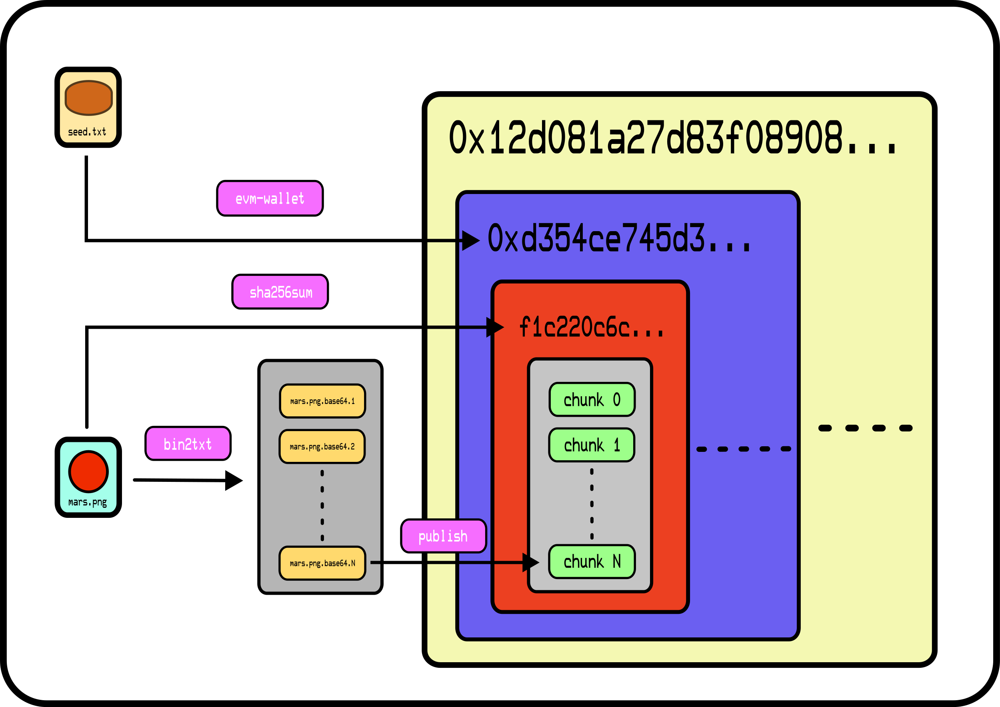

[comment]: <> (SPDX-License-Identifier: AGPL-3.0)

[comment]: <> (-------------------------------------------------------------)
[comment]: <> (Copyright © 2024, 2025  Pellegrino Prevete)
[comment]: <> (All rights reserved)
[comment]: <> (-------------------------------------------------------------)

[comment]: <> (This program is free software: you can redistribute)
[comment]: <> (it and/or modify it under the terms of the GNU Affero)
[comment]: <> (General Public License as published by the Free)
[comment]: <> (Software Foundation, either version 3 of the License.)

[comment]: <> (This program is distributed in the hope that it will be useful,)
[comment]: <> (but WITHOUT ANY WARRANTY; without even the implied warranty of)
[comment]: <> (MERCHANTABILITY or FITNESS FOR A PARTICULAR PURPOSE. See the)
[comment]: <> (GNU Affero General Public License for more details.)

[comment]: <> (You should have received a copy of the GNU Affero General Public)
[comment]: <> (License along with this program.)
[comment]: <> (If not, see <https://www.gnu.org/licenses/>.)

# Ethereum Virtual Machine File System Architecture

The file system itself consists of a set of Solidity smart contracts.

### Version 1.0

Version 1.0 is composed by the following contracts.

- FileSystem,
- LengthLock,
- CrossChainFileSystem.

### FileSystem 

The main basic contract.

Each address on the network is assigned a namespace in which
files are uniquely identified by their SHA-256 hash.
Files are split in chunks, encoded with an UTF-8 compatible
encoding (by default base64) and stored onto the blockchain
as integer mappings to text strings.
After having been correctly uploaded, the chunks encoded
strings are locked to avoid tampering.

<p
  align="center">
    
    <i>
      How evmfs-publish writes on FileSystem.
    </i>
</p>

In the picture above, the yellow, blue and red boxes
respectively represent
- a FileSystem contract deployment (`0x12d...`),
- an user namespace (`0xd354...`) and
- the checksum of the uploaded `mars.png` file (`f1c220...`).

### LengthLock 

By default the FileSystem contract does not force users
to specify in advance how many encoded chunks make up
a given file, so even if all chunks composing a file are locked,
if new chunks are uploaded at a later moment the `evmfs-get` program
will download them as well, thus breaking the checksum and making
the file unreadable.

Since the original chunks making up the file are still there
there is no reason actually the file couldn't be recovered
by checking at each chunk if the resulting checksum
is correct. Still, being that quite excessive, by default
`evmfs-publish` will write the correct amount of chunks
making up the file on the LengthLock contract.

### CrossChainFileSystem

The CrossChainFileSystem is the index contract which lets
users publish files on an array of `FileSystem` instances,
eventually from many EVM-compatible networks at once.
It shares the same structure of `FileSystem` but instead of
pointing to the file's chunks encoded strings it points
to couples of the form

```
(evm_network_chain_id, fs_address)
```

By accessing the actual chunks strings at the pointed evmfs
instances on the corresponding networks files are then
recomposed using `txt2bin`.
